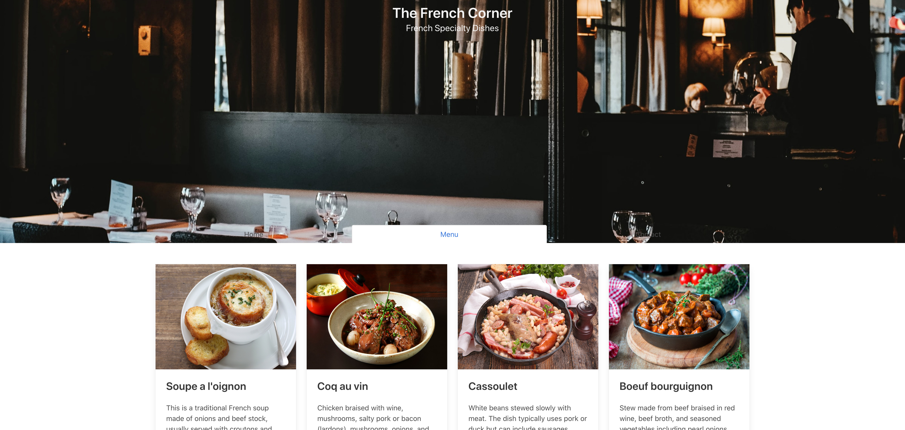

# Restaurant Page

<!-- TABLE OF CONTENTS -->
## Table of Contents

* [About the Project](#about-the-project)
  * [Installation](#installation)
  * [Built With](#built-with)
* [Authors](#authors)
* [Acknowledgements](#acknowledgements)

<!-- ABOUT THE PROJECT -->
## About The Project

The main goal of this project is to show the the benefits of modularized code as well as the ability to set up a javascript application made of different modules using webpack.

## Live Demo
[Restaurant Page](https://competent-khorana-4e2edf.netlify.app/)
<!-- INSTALLATION -->
## Installation

Download or clone the [repo here](https://github.com/mariobarrioss/restaurant-page) and open the html file in the browser of your choice.

### Built With
This project was built using these technologies.
* HTML
* CSS3
* Vanila Javascript
* Webpack

<!-- AUTHORS -->
## Authors

👤 **Mario Barioss**

- Github: [@mariobarrioss](https://github.com/mariobarrioss)
- Twitter: [Twitter](https://twitter.com)
- Linkedin: [LinkedIn](https://www.linkedin.com)

<!-- ACKNOWLEDGEMENTS -->
## Acknowledgements
* [The Odin Project](https://www.theodinproject.com/)
* [MDN](https://developer.mozilla.org/en-US/docs/Web/JavaScript)

